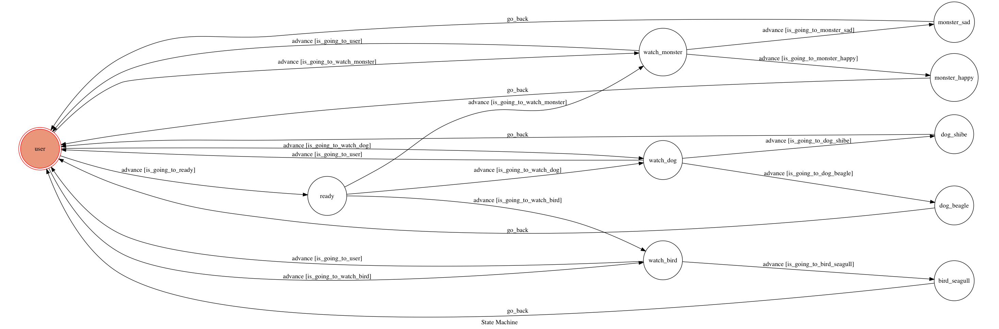

# TOC_Final_Project_F74036093

## 使用語言
* python3

## How to run?
* 將app.py中的WEBHOOK_URL修改成適當的鍵結後再執行app.py即可


## How to interact?
第一步先輸入任意的文字並送出，bot就會送出歡迎訊息：

```sh
嗨～我這裡有一些漂亮的圖片！ 想看“卡通角色”還是“狗狗”或是“鳥兒”呢？
```

輸入“”內的選項，就會轉換到不同的state並且給出不同的訊息

在接下來只要輸入括號內的文字就可以看到圖片

bot輸出圖片後就會回到一開始的state並等待使用者輸入任意文字


## Finite State Machine

